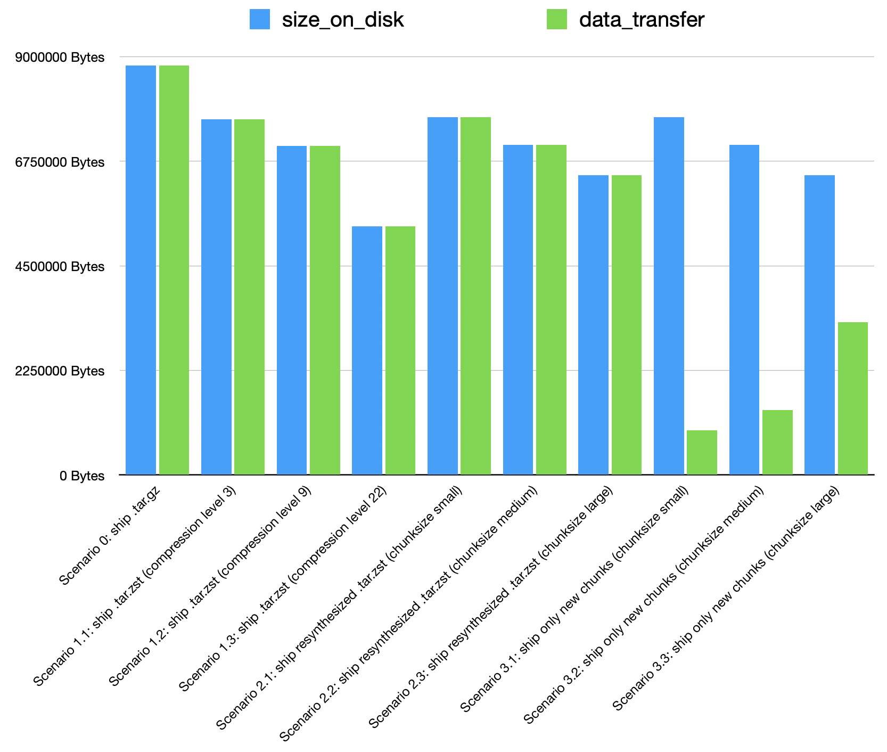

# PkgCompressedChunkedExperiment

This repository's purpose is to prove out a possible forward path on improving registry and package updates for Julia.

## Running the code

To run the experiment locally, first run:

```
julia --project PopulatePkgServerChunkStore.jl
julia --project ServeChunkStore.jl
```

This will download some registries for use, then chunk those and create what a PkgServer would contain; a chunk store and some indexes.
It will then start an HTTP server on port 8000 that serves the current directory, so that we can create this mockup with the greatest possible fidelity.

Next, run:
```
julia --project SimulateClientRegistryUpdate.jl
```

This will simulate a client starting with an old registry, downloading a new index, then identifying which chunks are needed, downloading them, and synthesizing a new registry, then hashing the decompressed output to prove it is bit-for-bit correct.

# Background

Our hypothesis is that there are significant savings to be had if we can somehow make use of the previous registry or package data that exists on client machines during the update process.
Previous proposals have included:
* Compressing registries and packages with `xz` or `zstd`.
* [Using `bsdiff`/`bspatch` to generate patches](https://github.com/mendsley/bsdiff) on the server side then transferring those to clients.

In the first case, the benefits did not pass the pain threshold for actual implementation, and in the second case, the complexity of generating patches (Which pairwise combinations do we generate among all the different registry or package versions, how best to allocate CPU time without allowing malicious actors to create denial-of-service attacks) kept the idea from being implemented.

## Content-Defined Chunking and Zstd Frames

The ideas laid out by [the `casync` project](https://0pointer.net/blog/casync-a-tool-for-distributing-file-system-images.html) directly solve the second issue nicely, by providing an efficient way to chunk files into small, content-addressed pieces, then update them by downloading any pieces that are missing, and reassembling the file from the disparate chunks.
We adapt the ideas of `casync` slightly by chunking our (uncompressed) tarfiles, storing the chunks as `zstd` files and then reconstituting our tarfiles by simply concatenating the compressed chunks wihtout needing to decompress each chunk, concatenate the uncompressed pieces, then recompressing.
This is possible due to a useful property of `zstd`, which is that a concatenation of frames must be correctly decoded as the concatenation of their outputs.
Our solution adds another small benefit, which is to insert metadata frames within the Zstd stream after each chunk identifying it by the content-addressed name that `casync`/`desync` would refer to it by.
In this way, our synthesized tarballs contain within them the chunk index they are constructed by, and updating a tarball to a new version is a simple as copying pieces out of that tarball and inserting some new ones downloaded from a server.
We also optimize the `zstd` storage slightly by training a `zstd` dictionary on the uncompressed pieces, which improves compression ratio significantly when dealing with such small fragments of files.

## Current results

Running the `SimulateClientRegistryUpdate.jl` script will give some limited statistics, but the `CompareCompressionSettings.jl` file performs a slightly more exhaustive test comparing a few different scenarios.
It compares the current methodology (transferring a gzipped tarball every time) to some of the alternatives, such as transferring a `zstd`-compressed tarball every time, and this content-defined chunking scheme.

A partial view of the results can be seen in this image:


While a simple `zstd`-compressed tarball can achieve the best on-disk compression ratio, the chunked forms achieve a much lower amount of data transferred for the update process.
This graph is showing results for only a single registry update (simulating a time delta of ~10 days), although the relative ordering of solutions remains constant over a variety of choices.

My current thinking is that we can probably go with the medium chunksize to reduce the number of chunks needed to be handled, as well as slightly improving the on-disk footprint.

## Future Work: Seekable Zstd Streams

A natural extension of this is to embed a [seek table](https://github.com/facebook/zstd/blob/v1.5.7/contrib/seekable_format/zstd_seekable_compression_format.md#seek-table-format) at the end of our compressed-chunk tarball, which would make it compatible with the [Zstd seekable format](https://github.com/facebook/zstd/tree/c5926fbab893423ec43439a82fbddcc1b40dfe1a/contrib/seekable_format).
This, combined with a random-access `Tar.jl` adapter, would provide the foundation for registries and packages that don't need to be unpacked from their archives, nor loaded entirely into memory.

